# 斗破快送项目介绍

《斗破快送》项目的定位是一款为餐饮企业（餐厅、饭店）定制的软件产品。该项目是一个在线外卖订购系统，顾客可以通过网站或者手机 App 订购餐点。该项目可以提供以下的功能：

1. 用户可以注册和登录账号，浏览餐厅列表，选择菜单，并下单和支付；

2. 餐厅可以注册账号并进行菜单管理，接收和处理订单；

3. 后台管理员可以管理餐厅和用户账号信息，处理订单和投诉，生成销售报表等。

   

《斗破快送》项目需要具备以下的技术要求：

1. 网站和小程序的设计和开发；

2. 数据库管理系统的设计和实现；

3. 支付系统的接入和开发；

> 《斗破快送》项目的优点是方便快捷、节省时间，满足了人们日常用餐的需求；缺点是可能存在繁琐的细节和服务质量的不确定性。

## 项目架构
项目的整体架构分为前端和后端，开发模式为前后端分离开发模式：
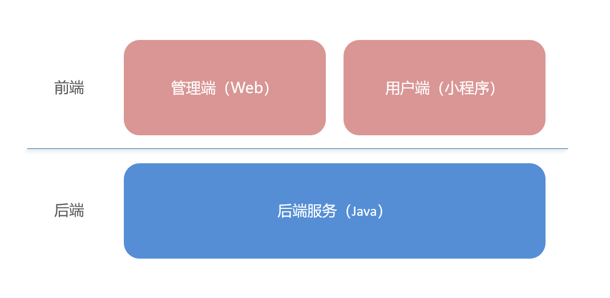
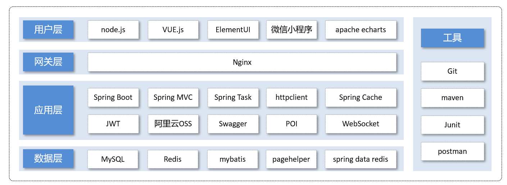

## 功能模块
项目中的业务功能模可划分为管理端和用户端两大模块，模块内业务功能细分如下：
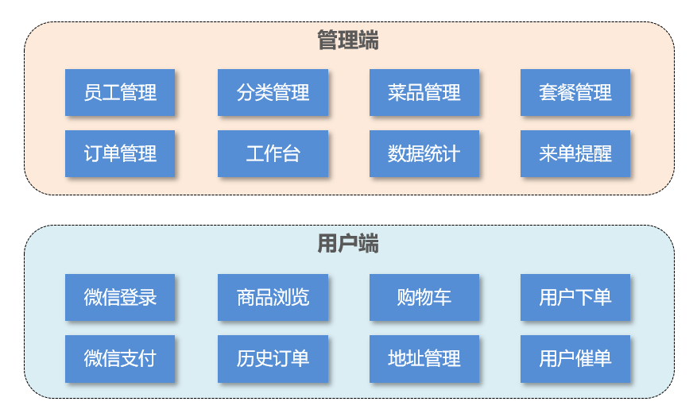

项目管理端截图

|                                                              |                                                              |                                                              |
| ------------------------------------------------------------ | ------------------------------------------------------------ | ------------------------------------------------------------ |
| 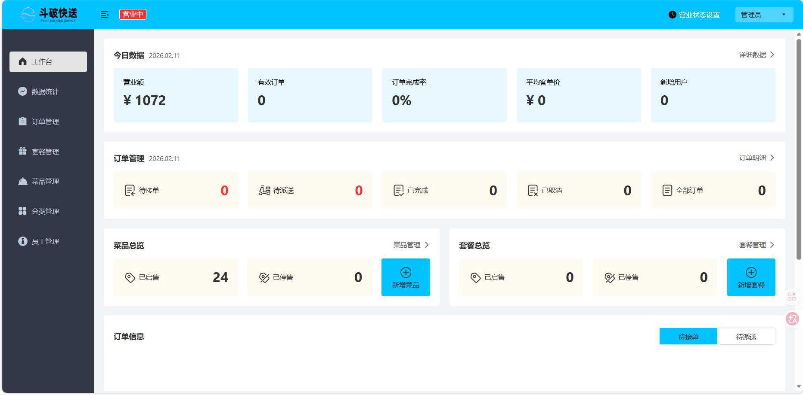 | 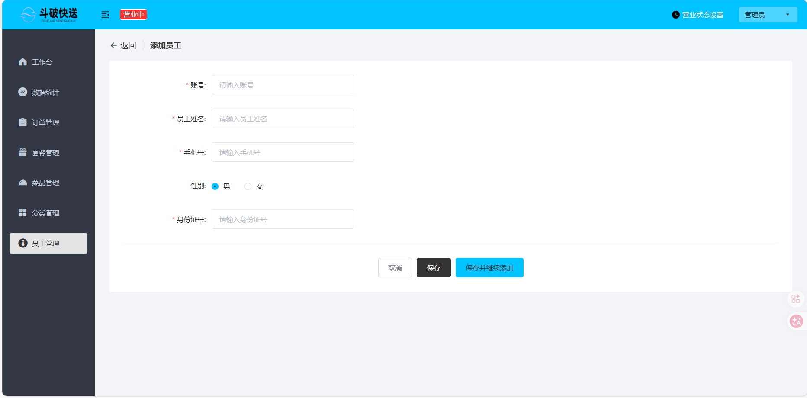 | 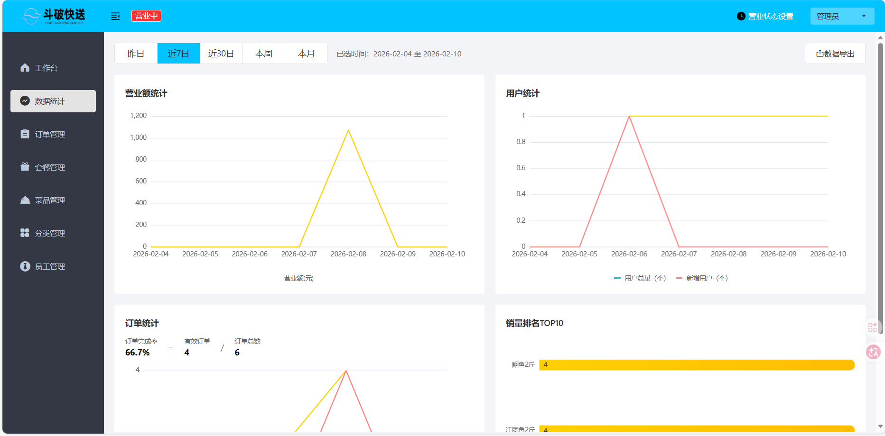 |
| 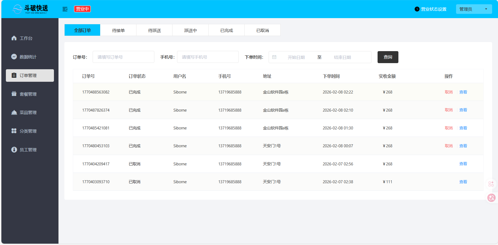 | 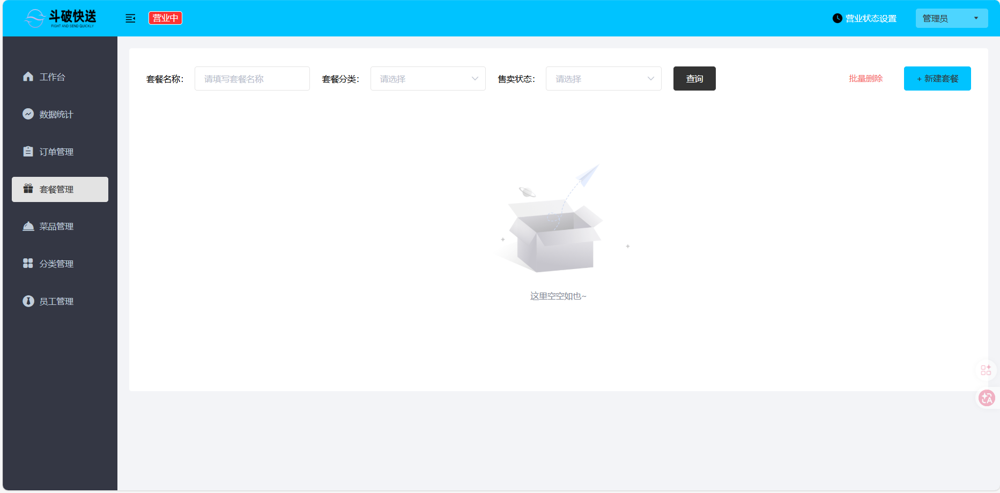 | 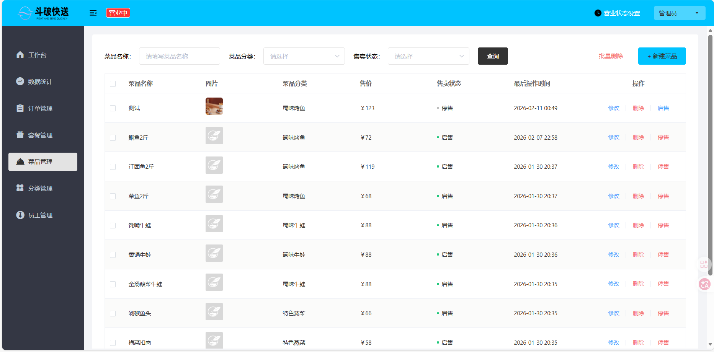 |
| 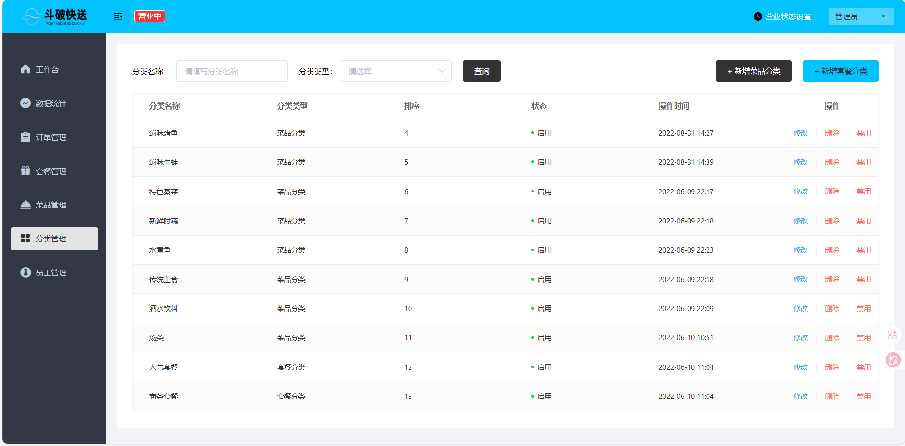 | 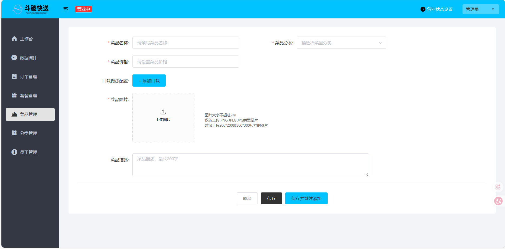 | 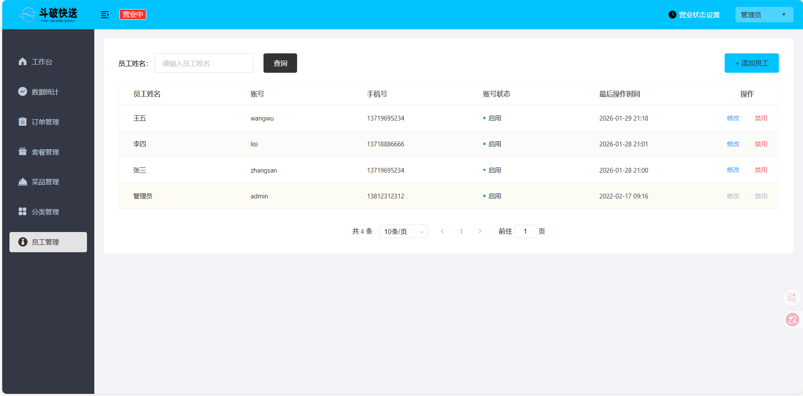 |

### 1). 管理端

餐饮企业内部员工使用。 主要功能有：

| 模块      | 描述                                                         |
| --------- | ------------------------------------------------------------ |
| 登录/退出 | 内部员工必须登录后，才可以访问系统管理后台                   |
| 员工管理  | 管理员可以在系统后台对员工信息进行管理，包含查询、新增、编辑、禁用等功能 |
| 分类管理  | 主要对当前餐厅经营的 菜品分类 或 套餐分类 进行管理维护， 包含查询、新增、修改、删除等功能 |
| 菜品管理  | 主要维护各个分类下的菜品信息，包含查询、新增、修改、删除、启售、停售等功能 |
| 套餐管理  | 主要维护当前餐厅中的套餐信息，包含查询、新增、修改、删除、启售、停售等功能 |
| 订单管理  | 主要维护用户在移动端下的订单信息，包含查询、取消、派送、完成，以及订单报表下载等功能 |
| 数据统计  | 主要完成对餐厅的各类数据统计，如营业额、用户数量、订单等     |

### 2). 用户端

移动端应用主要提供给消费者使用。主要功能有：

| 模块        | 描述                                                         |
| ----------- | ------------------------------------------------------------ |
| 登录/退出   | 用户需要通过微信授权后登录使用小程序进行点餐                 |
| 点餐-菜单   | 在点餐界面需要展示出菜品分类/套餐分类， 并根据当前选择的分类加载其中的菜品信息，供用户查询选择 |
| 点餐-购物车 | 用户选中的菜品就会加入用户的购物车，主要包含 查询购物车、加入购物车、删除购物车、清空购物车等功能 |
| 订单支付    | 用户选完菜品/套餐后，可以对购物车菜品进行结算支付，这时就需要进行订单的支付 |
| 个人信息    | 在个人中心页面中会展示当前用户的基本信息，用户可以管理收货地址，也可以查询历史订单数据 |

# 技术选型

关于本项目的技术选型， 这里将会从 用户层、网关层、应用层、数据层 这几个方面进行介绍，主要用于展示项目中使用到的技术框架和中间件等。项目中使用到的技术框架和中间件如下：

1. 用户层

   本项目中在构建系统管理后台的前端页面，用到了H5、Vue.js、ElementUI、apache echarts(展示图表)等技术。而在构建移动端应用时，使用到了基于uniapp制作的微信小程序。

2. 网关层

   Nginx是一个服务器，主要用来作为Http服务器，部署静态资源，访问性能高。在Nginx中还有两个比较重要的作用： 反向代理和负载均衡， 在进行项目部署时，要实现Tomcat的负载均衡，就可以通过Nginx来实现。

3. 应用层

   - `SpringBoot`： 快速构建Spring项目， 采用 “约定优于配置” 的思想， 简化Spring项目的配置开发。

   - `SpringMVC`：SpringMVC是spring框架的一个模块，springmvc和spring无需通过中间整合层进行整合，可以无缝集成。

   - `Spring Task`： 由Spring提供的定时任务框架。

   - `Httpclient`： 主要实现了对http请求的发送。

   - `Spring Cache`： 由Spring提供的数据缓存框架

   - `JWT`： 用于对应用程序上的用户进行身份验证的标记。

   - `阿里云OSS`： 对象存储服务，在项目中主要存储文件，如图片等。

   - `Swagger`： 可以自动的帮助开发人员生成接口文档，并对接口进行测试。

   - `POI`： 封装了对Excel表格的常用操作。

   - `WebSocket`： 一种通信网络协议，使客户端和服务器之间的数据交换更加简单，用于项目的来单、催单功能实现。

4. 数据层

   - `MySQL`： 关系型数据库， 本项目的核心业务数据都会采用MySQL进行存储。

   - `Redis`： 基于key-value格式存储的内存数据库， 访问速度快， 经常使用它做缓存。

   - `Mybatis`： 本项目持久层将会使用Mybatis开发。

   - `Pagehelper`： 分页插件。

   - `Spring Data Redis`： 简化java代码操作Redis的API。

5. 工具

   - `git`： 版本控制工具， 在团队协作中， 使用该工具对项目中的代码进行管理。

   - `maven`： 项目构建工具。

   - `junit`：单元测试工具，开发人员功能实现完毕后，需要通过junit对功能进行单元测试。

   - `postman`： 接口测工具，模拟用户发起的各类HTTP请求，获取对应的响应结果。	

# 如何启动

## 后端服务启动步骤

1. **创建 MySQL 数据库**  
   执行数据库初始化脚本，创建项目所需的数据库表结构和初始数据。

2. **配置 [application-dev.yml](file://S:\Users\90438\Desktop\Sto-box\700-project\doupo-take-out\background\doupo-take-out\doupo-server\target\classes\application-dev.yml) 文件**  
   在 `src/main/resources` 目录下创建 [application-dev.yml](file://S:\Users\90438\Desktop\Sto-box\700-project\doupo-take-out\background\doupo-take-out\doupo-server\target\classes\application-dev.yml) 配置文件，并根据实际环境填写数据库连接、Redis 配置等相关参数。

3. **启动 Spring Boot 应用**  
   通过 Maven 或 IDE 运行 ` SpringApplication.run()` 方法，启动后端服务。

4. **验证服务状态**  
   访问 Swagger 文档页面（如：`http://localhost:8080/docs.html`），确认接口是否正常运行。
